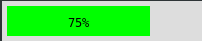
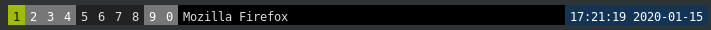

Viereck, a flexbox-powered graphical overlay
============================================

`viereck` is an X11 tool to display graphics as an overlay. It can be
considered as an attempt to replace `dzen2`.

A few example pictures:



_Done using the `scripts/battery.sh` script._



_Done using the `scripts/panel.sh` script._

# How to install

Currently `viereck` is just a cargo package, so you can install it using `cargo`;

```
$ cargo install viereck
```

This will put `viereck`, `viereck-text` and `viereck-container` into `~/.cargo/bin`,
be sure to have that path in your `$PATH` variable.

# How to use

`viereck` works by sending into `stdin` single-line configurations. (Currently
only JSON is supported, however other formats are being explored.) This
configuration is parsed and transformed into containers and content and then
laid out using [`stretch`](https://docs.rs/stretch/) which is a flexbox
library. This allows for both absolute positioned rendering but also relative,
where the content dictates how everything is laid out. The end result is that
one can easily build dynamic displays about any information you might want to
visualize. This is especially powerful due to the % width that one can use to
create progress bars, charge meters, wifi-strength displays and much more. And all
this works both horizontally and vertically at the same time!

The structure one pipes in looks like this:

- No new lines except at the end, it is used to demarcate different configurations
- The top-level construct has to be an array, inside which can be any kind of object.


**Objects:**

- `container`: Which is able to hold other objects, and is the main positioning tool.
    You can see it like a `<div>` in HTML.
- `text`: Which is a terminal object, meaning it cannot contain any other objects. You
    are able to use any installed font on your Computer as it supports modern formats like
    `ttf`.

**An example generated by `scripts/battery.sh`:**

```json
[
  {
    "type": "Container",
    "children": [
      {
        "background": {
          "Rgba32": 16711935
        },
        "children": [
          {
            "color": {
              "Rgba32": 255
            },
            "font": "DejaVu Sans Mono",
            "font_size": 12,
            "style": {},
            "text": "56%",
            "type": "Text"
          }
        ],
        "style": {
          "alignItems": "center",
          "justifyContent": "center",
          "size": {
            "height": "auto",
            "width": {
              "percent": 0.56
            }
          }
        },
        "type": "Container"
      }
    ],
    "style": {
      "padding": {
        "start": {
          "points": 5
        },
        "end": {
          "points": 5
        },
        "top": {
          "points": 5
        },
        "bottom": {
          "points": 5
        }
      },
      "flexGrow": 1
    },
    "background": null
  }
]
```

# Roadmap

- [ ] Make text better to use
    - [ ] Use (optional) ellipses if the text is too long
    - [ ] Positioning is still off
- [ ] Add picture drawing
    - [ ] Sent in via base64 or using a path
- [ ] SVG Drawing (?)

# Contributing

Simply fork this repository and send in some PRs. Make sure that you are fine with your
code being freely available to everyone and that you follow the correct licenses.
